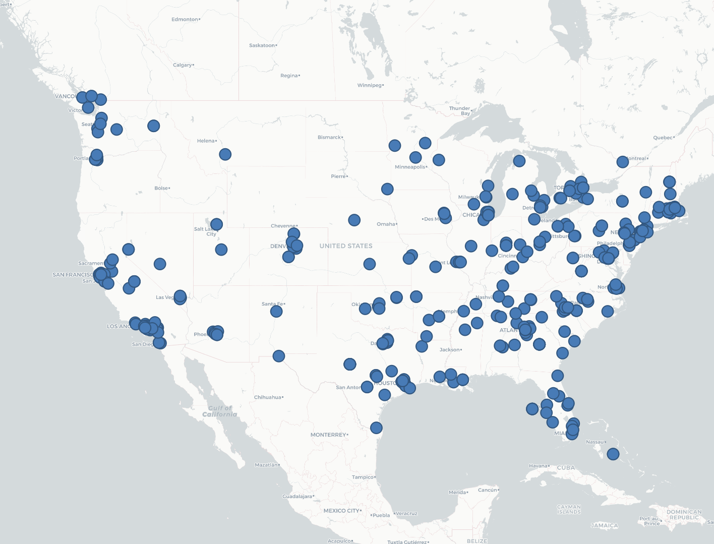
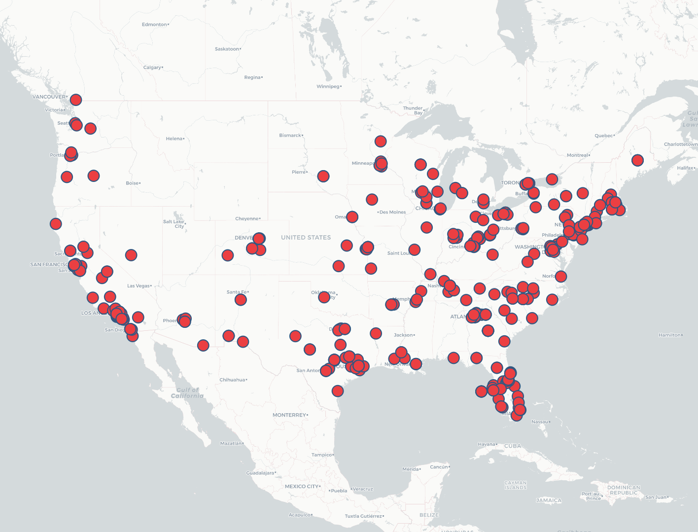
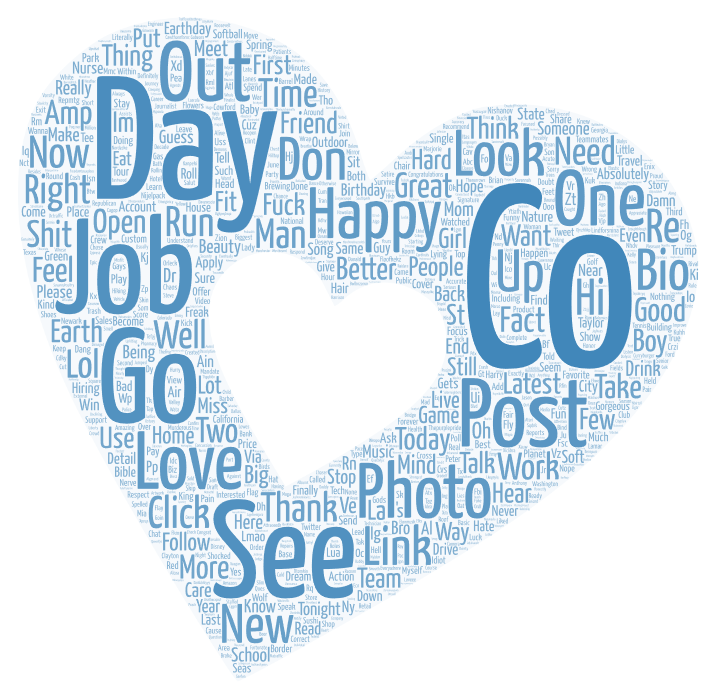
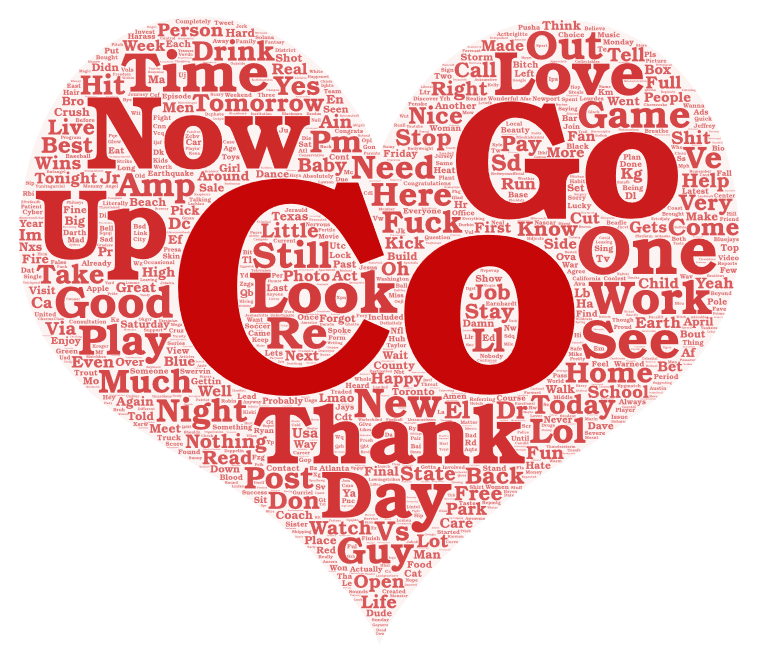

# GEOG458 Lab2
## Comparison of two time periods:
The regions I chose are all in the United States, but they are based on different time periods. I chose pacific daylight time **2 p.m.** and **4 p.m.** in a day, and looked at the geographic distribution of geotagged tweets during those two periods. I chose this time frame comparison because different parts of the US have different time zones, and I wanted to see if people would tweet less or more from a particular region based on the time differences.

## Comparison of two maps:
Map1(2PM): 

Map2(4PM): 
By observing the above two maps, we can find that the distribution of geotagged tweets is roughly the same at 2pm and 4pm at Pacific Daylight Time. Mainly in the southeastern and western United States. The difference is in the details. Tweets from Washington and California were more concentrated at 2 p.m., and scattered at 4 p.m. But it's more pronounced in the middle and east. I think the difference is also due to different time zones, and different time zones have different activities due to darkness. So this has led to a shift in how people tweet across the East and west of the Country

## Comparison of two word clouds:
Word Cloud1(2PM): 

Word Cloud2(4PM): 

By observing these two pictures of Word Clouds. I found a lot of similar words, suggesting that people were posting similar things between the two time periods. But I also saw some differences, like at 4pm Pacific Daylight Time, it is already night in some areas. So in the second picture I see some words for evening activities like drink, night, Wines and so on. So what people post in different places is different depending on the time difference.